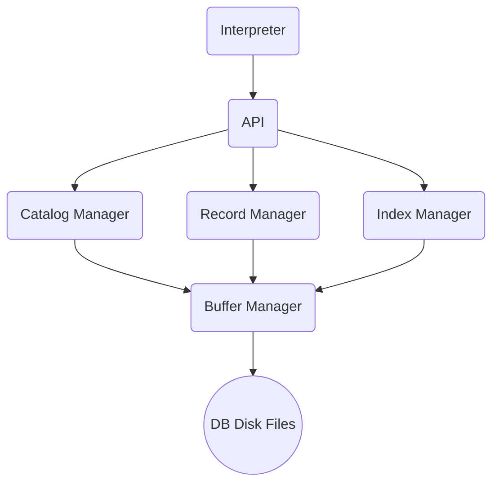
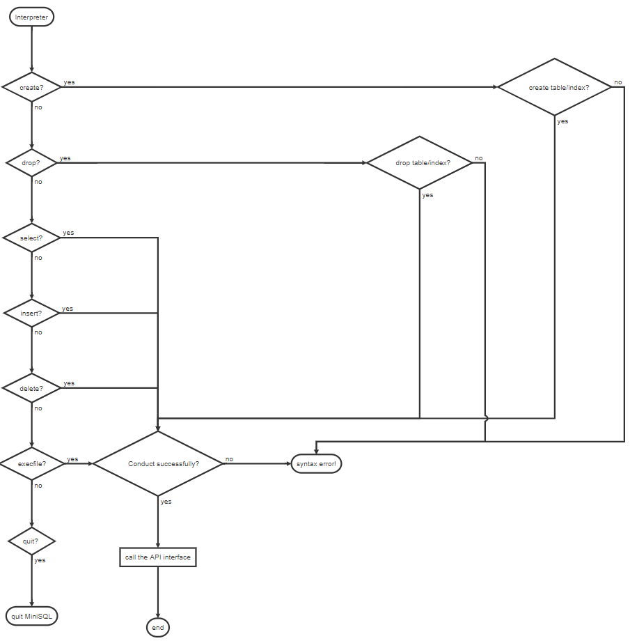
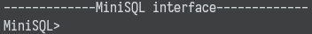
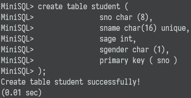
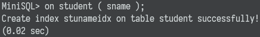
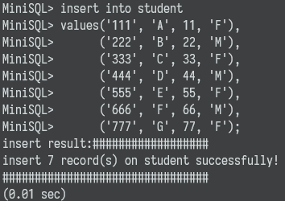
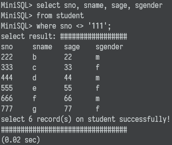
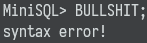
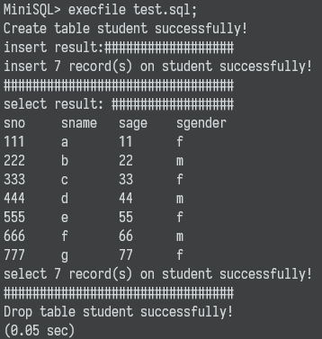
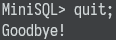

<div style="margin: 0 auto;text-align: center;font-size: 40px;font-weight: bold"><text>MiniSQL设计报告</text></div>

  	<p style="text-align: center;font-size: 25px;">第12组</p>


<p style="text-align: center;font-size: 20px;">
课程名称：<u>&nbsp&nbsp&nbsp&nbsp&nbsp&nbsp&nbsp数据库系统&nbsp&nbsp&nbsp&nbsp&nbsp&nbsp&nbsp&nbsp&nbsp</u>
</p>
<p style="text-align: center;font-size: 20px">
指导教师： <u>&nbsp&nbsp&nbsp&nbsp&nbsp&nbsp&nbsp&nbsp&nbsp&nbsp&nbsp庄越挺&nbsp&nbsp&nbsp&nbsp&nbsp&nbsp&nbsp&nbsp&nbsp&nbsp&nbsp&nbsp</u>
</p>


<p style="text-align: center;font-size: 20px">
2020 年 6 月 30 日
</p>
[toc]

## 一、实验概览

### 1.1 实验目的

​	设计并实现一个精简型单用户SQL引擎(DBMS)**MiniSQL**，允许用户通过字符界面输入SQL语句实现表的建立/删除；索引的建立/删除以及表记录的插入/删除/查找。通过对**MiniSQL**的设计与实现，提高学生的系统编程能力，加深对数据库系统原理的理解。

### 1.2 实验需求

#### 数据类型

​	要求支持3种数据类型：`int`，`float`，`char(n)`；其中 1 ≤ n ≤ 255

#### 表定义

​	一个表最多可以定义32个属性，各属性可以指定是否为`unique`；支持单属性的主键定义

#### 索引的建立和删除

​	对于表的主属性自动建立B+树索引，对于声明为`unique`的属性可以通过SQL语句由用户指定建立/删除B+树索引（所有的B+树索引都是单属性单值的）

#### 查找记录

​	可以通过指定用`and`连接的多个条件进行查询，支持等值查询和区间查询

#### 插入和删除记录

​	支持每次一条或多条记录的插入操作；支持每次一条或多条记录的删除操作

### 1.3 实验环境

​	本项目全部采用**C++**语言实现，通过[GitHub](https://github.com/)托管代码、管理版本。

### 1.4 整体框架

​	**MiniSQL**主要包含6个模块：

+ Interpreter

+ API

+ Catalog Manager

+ Record Manager

+ Index Manager

+ Buffer Manager

  此外，数据库在磁盘上保存至相应的磁盘文件中：

+ "./database/catalog" 文件保存数据库目录信息

+ "./database/record/" 目录下保存各张表的记录文件

+ "./database/index/" 目录下保存各张表的各个索引文件

  **MiniSQL**的各个模块的层级图如下：



​	各模块间的详细交互方式如下图所示：

```sequence
Title: MiniSQL整体架构图
Interpreter->API:调用接口，实现具体的数据库操作
Note over Interpreter:最顶层
API-->Interpreter:返回执行状态
Note over API:核心层
API->Catalog Manager:调用接口
API->Record Manager:调用接口，执行记录文件的更新
API->Index Manager:调用接口，创建/删除索引，更新键值信息
Note over Index Manager, Catalog Manager:同一层级
Catalog Manager-->API:返回表信息
Record Manager-->API:调用API内部函数，获取相关信息
Index Manager-->API:调用API内部函数，初始化所有建立过的索引
Note over Buffer Manager: 3个Manager与磁盘的交互途径
Catalog Manager->Buffer Manager:读写缓冲池中的磁盘文件
Record Manager->Buffer Manager:读写缓冲池中的磁盘文件
Index Manager->Buffer Manager:读写缓冲池中的磁盘文件
Buffer Manager->DB Disk Files:将缓冲池对应页写至磁盘文件
Note over DB Disk Files:最底层
DB Disk Files->Buffer Manager:将磁盘文件指定块读至内存
```

​	详见第二章"各模块实现功能"。


## 二、各模块实现功能

### 2.1 Interpreter

​	Interpreter模块负责解析SQL语句，并返回相应信息。主要实现了程序流程控制整体框架，即“启动并初始化、接收命令、处理命令、显示命令结果、循环、退出 “流程。同时接收并解释用户输入的命令，生成命令的内部数据结构表示，检查命令的语法正确性和语义正确性，按照要求返回相应信息

### 2.2 API

​	API模块整合了更底层的Record Manager、Index Manager、Catalog Manager，以实现Interpreter层需要的更为复杂的功能。作为数据库系统的核心，API模块提供给Interpreter的接口包括：创建表、删除表、创建表、删除表、查询记录、插入记录、删除记录。API模块综合调度3个Manager；从Catalog Manager获取表/数据库的信息，进一步调用Record Manager和Index Manager，完成记录和索引的更新或查询。

### 2.3 Catalog Manager
​	Catalog Manager主要记录了所有表的定义信息，将每一个表信息按一定格式记录在文件中，并提供方位上述信息的接口，同时Catalog Manager调用Buffer Manager实际完成完成表的创建、删除等等相关功能。

### 2.4 Record Manager

​	Record Manager主要为API提供记录的插入、删除、查询功能的接口；Record Manager负责每个表的记录文件的创建、更新以及在磁盘上的保存。利用Buffer Manager，Record Manager可以有效地通过较少的磁盘访问进行尽可能多的记录读写。

### 2.5 Index Manager

​	Index Manager实际上是B+树的驱动模块，负责索引创建、索引删除、键值插入、键值删除、键值等值查找。

​	B+树是平衡树数据结构，通常用于数据库和操作系统的文件系统中，其插入与修改具有较稳定的对数时间复杂度，因为数据访问时磁盘I/O耗时更加显著，B+树可以最大化内部结点的储存数据量，从而显著减少I/O耗时。在文件"BpTree.h"中，用类模板的方式实现了B+树的查找、插入、删除操作；同时，利用Buffer Manager，读取磁盘上的索引文件可以重构B+树，在磁盘上进行记录至索引文件可以保存B+树。

​	Index Manager掌管3张由索引文件名映射到B+树地址的`std::map`，分别对应键值为`int`、`float`、`string`(即`char(n)`)类型。`IndexManager`对象可以间接地创建、删除或找到索引对应的B+树，再进行之前提到的索引相关的操作。Index Manager实现了索引文件/B+树在磁盘上的记录与读取，即"永久"索引。

### 2.6 Buffer Manager

​	具体来说，Buffer Manager模块涉及`Page`和`BufferManager`对象，并实现了相应部分功能。功能如下：

1. 读取指定的数据到系统缓冲区或将缓冲区中的数据写出到文件。
2. 记录缓冲区中各页的状态，如是否被修改过、是否有效等。
3. 提供缓冲区页的pin功能，及锁定缓冲区的页，不允许替换出去。(用于替换策略)  
4. 使用时钟替换算法实现页面替换。

​	Buffer Manager掌管内存中的一片缓冲池。更高层的Catalog Manager、Record Manager、Index Manager利用Buffer Manager与磁盘文件交互，是一种能有效减少磁盘访问次数的读写数据库文件的方法。

## 三、分工说明

+ 谢廷浩：负责部分Buffer Manager模块、部分API模块、Index Manager驱动部分的设计、B+树与磁盘交互的实现，并进行了全局的debug，将各个模块串联起来。
+ To be continued.

## 四、各模块提供接口与内部实现

### 4.1 Interpreter

#### 4.1.1 `Interpreter`类

```c++
class Interpreter
{
public:
	API *api;
	string filename;
	int interpreter(string s);
	Interpreter() {};
	~Interpreter() {};
private:
	string getWord(string s, int& index);
	string getWord_no_symbol(string s, int& index);
	int string2num(string s);
};
```

**成员变量**

+ API接口 `api`
+ 执行文件名`filename`

**成员函数**

+ 构造函数和析构函数
+ 解析函数(用于语义解析传入的语句) `interpreter`
+ 提取单词或字符 `getWord`
+ 只读取单词忽略标点符号`getWord_no_symbol`

#### 4.1.2 工作流程

​	Interpreter的工作流程图如下：



#### 4.1.3 输入说明

+ 输入的所有字符都不区分大小写，在输出时会自动转为小写状态

+ 换行前的语句后面要加至少一个空格/回车。比如：

  `select sno·换行·from student;`是不合理的，而`select sno ·换行·from student;`是合理的

+ 输入语句若需要声明是字符串数据，需要用单引号扩起来，比如`'example_string'`

+ 支持标准的sql语句

  （1）建表

  ```mysql
  create table [表名] {
  		[属性名1] [数据类型1] [可选择说明是否为unique],
  		[属性名2] [数据类型2] [可选择说明是否为unique],
  		... ...
  		primary key (属性名x) [必须存在]
  };
  ```

  其中数据类型有三种：整数类型`int`、浮点数类型`float`、字符串类型`char(n)`

  （2）创建索引

  ```mysql
  create index [索引名] 
  on [表名] ([表中某一属性名]);
  ```

  （3）删除索引

  ```mysql
  drop index [索引名] on [表名];
  ```

  （4）删除表格

  ```mysql
  drop table [表名];
  ```

  （5）select-from语句：对表格所有的元组做投影

  ```mysql
  select [属性名1], [属性名2], [属性名3], ...
  from [表名];
  ```

  （6）select-from-where语句：选出部分表格的元组做投影

  ```mysql
  select [属性名1], [属性名2], [属性名3], ... ...
  from [表名]
  where [条件1] and [条件2] and ... ...
  ```

  其中条件为关于属性的不等式，比如：`sage >= 30`, `sgender <> 'M'`, `sname = 'A'`，并且只支持条件之间的逻辑与操作（即关键字`and`）

  如果希望全选，则用`select * `

  （7）delete-from语句：全表记录/元组删除

  ```mysql
  delete from [表名];
  ```

  （8）delete-from-where语句：删除满足条件的记录/元组

  ```mysql
  delete from [表名]
  where [条件1] and [条件2] and ... ...
  ```

+ 不同的语句之间以分号`;`作为分隔，在输入sql语句时，也只在碰到分号`;`后才开始执行

+ 可以在运行程序后在命令行直接输入sql语句，或是全部写在文件中`sql.txt`，然后在命令行输入`execfile sql.txt;`后执行

#### 4.1.4 输出说明

- 如果SQL语句执行成功，执行后会返回成功信息。

  (1) 建表/删除表格

  ```
  Create table [表名] successfully!
  Drop table [表名] successfully!
  ```

  (2)建立索引/删除索引

  ```
  Create index [索引名] on table [表名] successfully!
  Drop index [索引名] on table [表名] successfully!
  ```

  (3)select语句

  若查询结果不为空，则输出第一行为属性名，其余每行表示一条记录。

  ```
  select result: #################
            [选择的属性名]
         [符合条件的记录]
  ################################
  ```

  若查询结果为空

  ```
  select result: #################
  [选择的属性名]
  ################################
  ```

  (4)insert语句

  ```
  insert result:##################
  insert [插入记录的数目] record(s) into [表名] successfully!
  ################################
  ```

  (5)delete语句

  ```
  delete result:##################
  delete [输出记录的数目] record(s) on [表名] successfully!
  ################################
  ```

  (6)quit语句

  ```
  Exit program!
  ```

- 如果SQL语句执行失败，执行后返回失败原因。

  (1) 建表失败可能出现的原因

  ```
  empty table!
  create table syntax error!
  char size overflow!
  unknown data type
  primary key not exist!
  Table [表名] already exists！
  ```

  (2) 建索引失败可能出现的原因

  ```
  index not exist error!
  create index syntax error!
  Table [表名] not exists!
  Index [索引名] already exists!
  Indices on table [表名] full!
  Attribute [属性名] not exists
  ```

  (3) 删除表或索引失败可能出现的原因

  ```
  empty table!
  index not exist error!
  drop index syntax error!
  Table [表名] not exists!
  Index [索引名] on table [表名] not exists!
  ```

  (4) select语句失败可能出现的原因

  ```
  query on multiple tables is not allowed!
  empty table!
  invalid operator!
  table [表名] not exist！
  attributes being queried not exist!
  ```

  (5) insert语句失败可能出现的原因

  ```mysql
  insert syntax error!
  table [表名] not exist！
  attributes being queried not exist!
  ```

  (6) delete语句失败可能出现的原因

  ```
  delete syntax error!
  table [表名] not exist！
  ```

### 4.2 API

API模块封装在`API`类中。

#### `API`类

```c++
class API
{
private:
	/*Internal function members below*/
	/*一些内部函数，不应该被interpreter调用！
	可能会被API本身、catalog manager、record manager、index manager模块调用
	没有列全，用到时自行补足即可*/
	//To be continued.

	//tableName:表名称
	//recordContent:记录record中实际内容
	//recordResult:用于存储一条record内容的指针
	//将recordContent中的内容转为一个char*指向的内容，之后recordResult指针会作为其它函数参数
	void recordStringGet(string tableName, vector<string>* recordContent, char* recordResult);
public:
	/*下面3个指针在main模块中才初始化，避免和3个manager产生冲突*/
	//指向全局catalog manager的指针
	CatalogManager *cm;
	//指向全局record manager的指针
	RecordManager *rm;
	//指向全局index manager的指针
	IndexManager *im;

	/*外部接口*/
	API() {};
	~API() {};
	//创建表
	bool createTable(std::string table_name, Attribute attribute, int primary, Index index);
	//删除表
	bool dropTable(std::string table_name);
	//创建索引
	void createIndex(string index_name, string table_name, string attribute_name);
	//删除索引
	void dropIndex(string table_name, string index_name);
	//展示记录 -- 无条件
	int showRecord(string table_name, vector<string>* attribute_names);
	//展示记录 -- 有条件
	int showRecord(string table_name, vector<string>* attribute_names, vector<Condition>* conditions);
	//插入记录
	void insertRecord(string table_name, vector<string>* record_content);
	//删除记录 -- 无条件
	int deleteRecord(string table_name);
	//删除记录 -- 有条件
	int deleteRecord(string table_name, vector<Condition>* conditions);
	
	//获取recordSize的函数
	int recordSizeGet(string tableName);
	//获取表中SingleAttribute的函数
	int attributeGet(string tableName, vector<SingleAttribute> *attributeVector);


	/*Internal function members below*/
	/*一些内部函数，不应该被interpreter调用！
	可能会被API本身、catalog manager、record manager、index manager模块调用
	没有列全，用到时自行补足即可*/
	//内部函数，插入**单个数据**对应的索引
	void insertIndex(string table_name, string index_name, char* key_addr, int type, int blockID);
	//内部函数，删除**单个数据**对应的索引
	void deleteIndex(string table_name, string index_name, char* key_addr, int type);
	//内部函数，删除给定地址开始的**一条记录**对应的索引
	void deleteRecordIndex(string table_name, char* record_begin, int record_size, Attribute attributes);
	//内部函数，插入给定地址开始的**一条记录**对应的索引
	void insertRecordIndex(string table_name, char* record_begin, int record_size, Attribute attributes, int blockID);
	//获得所有index的信息：<index文件名，index的type> -- 在Index_Manager.cpp中用于初始化所有index文件
	vector<pair<string, int> > allIndexInfoGet();
	//To be continued.
};
```

**成员变量**

+ `cm`：Catalog Manager的指针
+ `rm`：Record Manager的指针
+ `im`：Index Manager的指针

**成员函数**

+ `bool createTable(std::string table_name, Attribute attribute, int primary, Index index)`

  **创建表**接口；创建名为`table_name`的表，其属性保存在`attribute`结构中，主键指定为第`primary`个，并传入一个空的`index`结构。内部依次调用Catalog Manager和Record Manager的建表接口，实现表的创建。

+ `bool dropTable(std::string table_name)`

  **删除表**接口；删除名为`table_name`的表。内部先删除表的所有索引，再依次调用Catalog Manager和Record Manager的删除表接口，实现表的删除。

+ `void createIndex(string index_name, string table_name, string attribute_name)`

  **创建索引**接口；在`table_name`表的`attribute_name`属性上创建名为`index_name`的索引（**注意：允许不同表拥有同名索引**）。内部先调用Catalog Manager的`CreateIndex()`在catalog上记录新建的索引，再利用Record Manager的`createIndex()`新建索引文件，之后调用Index Manager的`createIndex()`创建相应的B+树，最后通过`RecordManager::indexRecordAllAlreadyInsert()`将已经存在的所有记录对应的（键值，blockID）插入到B+树中。

+ `void dropIndex(string table_name, string index_name)`

  **删除索引**接口；删除`table_name`表上的`index_name`索引。内部先调用Catalog Manager的`DropIndex()`在catalog上删除表的索引信息，随后依次调用Record Manager、Index Manager的`dropIndex()`接口，删除磁盘以及内存中的索引文件/B+树。

+ `int showRecord(string table_name, vector<string>* attribute_names)`

  **无条件查询记录**接口（即没有`where`语句）；将`table_name`表的**所有记录**投影到`attribute_names`上进行打印。实际上会交由有条件查询记录接口进行查询。

+ `int showRecord(string table_name, vector<string>* attribute_names, vector<Condition>* conditions)`

  **有条件查询记录**接口（即有`where`语句）；将`table_name`表中所有符合`conditions`中所有条件的记录，投影到`attribute_names`上进行打印（注意：**只支持`and`连接的条件**）。如果`conditions`的某个条件为**等值判定**，且判定属性已经建立了索引（那就意味着如果存在符合条件的记录，该记录必然是唯一的），则会利用索引直接找到该记录所在的块，再呈递给Record Manager加速查询；否则Record Manager需要遍历磁盘文件的每个块找到所有符合条件的记录。

+ `void insertRecord(string table_name, vector<string>* record_content)`

  **插入记录**接口；在`table_name`表中插入一条记录，记录内容由`record_content`指向的`std::vector`记录（依次保存每个属性的字符串值）。内部先处理`record_content`，将`int`、`float`类型的数据的字符串转换成二进制数据，暂时存放在内存的`recordString`（记录插入的一条记录）中。随后调用Record Manager将`recordString`写到缓冲池中，最终记录到磁盘上。此外，如果该表建立了索引，则需要向索引文件插入相应的（键值，blockID）以更新索引。

+ `int deleteRecord(string table_name)`

  **无条件删除记录**接口（即没有`where`语句）；删除`table_name`表的**所有记录**。实际上会交由有条件删除记录接口进行删除。

+ `int deleteRecord(string table_name, vector<Condition>* conditions)`

  **有条件删除记录**接口（即有`where`语句）；删除`table_name`表中同时所有满足`conditions`中每个条件的记录（注意：**只支持`and`连接的条件**）。如果`conditions`的某个条件为**等值判定**，且判定属性已经建立了索引（那就意味着如果存在符合条件的记录，该记录必然是唯一的），则会利用索引直接找到该记录所在的块，再呈递给Record Manager加速删除；否则Record Manager需要遍历磁盘文件的每个块找到所有符合条件的记录并删除。

### 4.3 Catalog Manager (To be continued.)


### 4.4 Record Manager

Record Manager模块插入、删除、查询功能实现相关的代码封装在`RecordManager`类中，对应的代码文件是"RecordManager.h"和"RecordManager.cpp"。在`RecordManager`类中还定义了`BufferManager`、`API`、`CatalogManager`类的指针以便于调用其中的一些函数。为了判断记录是否符合条件定义了`Condition`类，其中提供了对记录进行判断的接口。

#### `RecordManager` 类

```c++
class RecordManager {
public:
	BufferManager *bm;
	CatalogManager *cm;
	API *api;

	string getTableFileName(string tablename);
	string getIndexFileName(string tablename, string indexname);
	//创建table时调用
	//创建存储table对应的文件
	//@tablename:table名称
	int createTable(string tablename);
	//删除table时调用
	//output所有buffer中的block并删除磁盘文件
	//@tablename:table名称
	int dropTable(string tablename);
	//创建index调用
	//创建存储index的对应文件
	//@indexname:index名称
	int createIndex(string tableName, string indexname);
	//删除index时调用
	//output所有buffer中的block并删除磁盘文件
	//@indexname:索引名称
	int dropIndex(string tableName, string indexname);

	//插入一条record
	//将record写入buffer中的page并设置page为dirty
	//@tablename:待插入的table名称
	//@record：指向待插入record的指针
	//@recordSize:待插入record的大小
	int recordInsert(string tablename, char* record, int recordSize);

	//根据条件查找record并显示
	//@tableName:表名
	//@attributeNameVector:select后的attribute
	//@conditionVector:where后的条件
	int recordAllShow(string tableName, vector<string>* attributeNameVector, vector<Condition>* conditionVector);

	//找出符合条件的record条数并返回
	//@tableName:表名
	//@attributeNameVector:select后的attribute
	//@conditionVector:where后的条件
	int recordAllFind(string tableName, vector<Condition>* conditionVector);
	//删除符合要求的record，返回值为删除的record条数
	//@tableName:表名
	//@conditionVector:where后的条件
	int recordAllDelete(string tableName, vector<Condition>* conditionVector);
	//insert表中的所有index,返回insert的条数
	//@tableName:表名
	//@indexName:索引名
	int indexRecordAllAlreadyInsert(string tableName, string indexName);

    //删除一个block中符合要求的记录
    //@tableName:表名
    //@conditionVector:
	int recordBlockDelete(string tableName, vector<Condition>* conditionVector, int pageID);

	//检查一条record是否符合conditionVector中的一系列条件
	//如果全部符合条件，返回true,否则返回false
	//@recordBegin:指向record记录开始部分的指针
	//@recordSize:record的大小
	//@attributeVector:指向一个包含record所有attribute的vector
	//@conditionVector:指向一个包含所有condition的vector
	bool recordConditionFit(char* recordBegin, int recordSize, vector<SingleAttribute>* attributeVector, vector<Condition>* conditionVector);
	int recordBlockShow(string table_name, vector<string>* attributeNameVector, vector<Condition>* conditionVector, int pageID);
private:
	
	int recordBlockFind(string tableName, vector<Condition>* conditionVector, int pageID);
	int indexRecordBlockAlreadyInsert(string tableName, string indexName, int blockID);

	//检查一条record的某个attribute是否符合condition
	//符合返回true,不符合返回false
	//@content:指向record中某一attribute
	//@type:attribute的类型，-1表示float,0表示int,其他数字表示string
	//@condition:指向某一个Condition类，即某一个条件
	bool contentConditionFit(char* content, int type, Condition* condition);

	void recordPrint(char* recordBegin, int recordSize, vector<SingleAttribute>* attributeVector, vector<string> *attributeNameVector);
	void contentPrint(char* content, int type);

	char* findFirstUsableBlock(string tablename);
	int findContentBegin(string table_name, char* block_content, int recordSize);
	bool noRecord(string table_name, char* recordBegin);
};
```

**成员变量**

+ `bm`：指向（全局共用的一个）Buffer Manager的指针
+ `cm`：指向（全局共用的一个）Catalog Manager的指针
+ `api`：指向（全局共用的一个）API的指针

**成员函数**

- ```getTableFileName(string tablename)```

  根据table名称得到table文件的路径并返回

- ```getIndexFileName(string tablename, string indexname)```

  根据index名称得到index文件的路径并返回

- ```createTable(string tablename)```

  创建表格时调用，在./database/record目录下生成对应的文件

- ```dropTable(string tablename)```

  删除table文件时调用，输出buffer pool中所有该table的记录文件的page并删除磁盘文件

- ```createIndex(string tableName, string indexname)```

  创建索引时调用，在./database/index下创建对应的储存索引的文件

- ```dropIndex(string tableName, string indexname)```

  删除index时调用，输出buffer pool中所有该index文件的page并删除磁盘文件

- ```recordInsert(string tablename, char* record, int recordSize)```

  给定表名、指向一条记录的指针、记录大小，将给定的记录插入表中

- ```recordAllShow(string tableName, vector<string>* attributeNameVector, vector<Condition>* conditionVector)```

  给定需要显示的属性名和查询条件，进行查询并输出结果

- ```recordAllFind(string tableName, vector<Condition>* conditionVector)```

  在指定的表中进行查找并返回符合条件的记录条数

- ```int recordAllDelete(string tableName, vector<Condition>* conditionVector)```

  删除表中符合条件的所有记录

- ```indexRecordAllAlreadyInsert(string tableName, string indexName)```


  查询表中已经插入的Index数目并返回

- ```recordBlockDelete(string tableName, vector<Condition>* conditionVector, int pageID)```

  删除指定block中符合条件的记录

- ```recordConditionFit(char* recordBegin, int recordSize, vector<SingleAttribute>* attributeVector, vector<Condition>* conditionVector)```

  判断一条record是否符合给定的条件

- ```recordBlockShow(string table_name, vector<string>* attributeNameVector, vector<Condition>* conditionVector, int pageID)```

  在指定的block中查询符合条件的记录并显示

### 4.5 Index Manager

​	Index Manager驱动模块的相关的代码主要在"IndexManager.h"和"IndexManager.cpp"中，而B+树实现、索引文件的在磁盘的记录代码则在B+树模块文件"BpTree.h"中。Index Manager共通过3个类实现：`IndexManager`、`BpNode`、`BpTree`。

#### 4.5.1 `IndexManager`类

```c++
class IndexManager
{
private:
    //传入的API指针
    API* api_;
    //定义类型：索引文件名 -> B+树 
    typedef std::map<std::string, BpTree<int, int>*> INTMAP;
    //定义类型：索引文件名 -> B+树 
    typedef std::map<std::string, BpTree<float, int>*> FLOATMAP;
    //定义类型：索引文件名 -> B+树 
    typedef std::map<std::string, BpTree<std::string, int>*> STRINGMAP;
    //映射 索引文件名 -> int键B+树
    INTMAP int_index_map_;
    //映射 索引文件名 -> float键B+树
    FLOATMAP float_index_map_;
    //映射 索引文件名 -> string键B+树
    STRINGMAP string_index_map_;
    

public:
    //0表示数据类型为float
    static const int TYPE_FLOAT = 0;
    //-1表示数据类型为int
    static const int TYPE_INT = -1;
    //正数表示数据类型为字符串，且值为字符串长度 + 1; 如34表示char(33)

    //构造函数
    //利用API间接调用catalog manager获取各表已有的index，在磁盘上找到对应的文件重构B+树
    IndexManager(API* api);
    
    //初始化函数
    void init();
    
    //析构函数
    //将已有的所有B+树写到磁盘上，释放内存
    ~IndexManager();

    //创建索引
    //@file_name：索引文件名（由record manager中的函数生成并传入）
    //@type: 索引的类型
    void createIndex(std::string file_name, int type);
    
    //删除索引
    //@file_name：索引文件名（由record manager中的函数生成并传入）
    //@type: 索引的类型
    void dropIndex(std::string file_name, int type);
    
    //单键值搜索
    //@file_name：索引文件名（由record manager中的函数生成并传入）
    //@key: 待搜索的键值
    //@type: 索引的类型
    //return: 
    //找到的话返回记录所在blockID
    //找不到key则返回-1
    //没有该index返回-2
    int searchIndex(std::string file_name, std::string key, int type);
    
    //（不要求范围搜索，故暂时不实现）多键值范围搜索
    // std::vector<int>* searchIndexRange();

    //插入单条索引
    //@file_name：索引文件名（由record manager中的函数生成并传入）
    //@key：索引键值
    //@blockID: 索引对应记录所在磁盘文件的block编号（注意，该处文件指磁盘中的记录文件，而非索引文件）
    //@type: 索引的类型
    void insertIndex(std::string file_name, std::string key, int blockID, int type);

    //根据传入键值删除单条索引
    //@file_name：索引文件名（由record manager中的函数生成并传入）
    //@key: 待删除的键值
    //@type: 索引的类型
    void deleteIndexByKey(std::string file_name, std::string key, int type);
};
```

**成员变量**

+ API类指针`api_`：用于调用API模块中的相关函数`API::allIndexInfoGet()`，以初始化所有磁盘上的索引至内存中（重构对应的B+树）
+ 索引文件名至B+树的3个（不同类型键值的）`std::map`，包括`int_index_map_`、`float_index_map_`和`string_index_map_`；B+树的两个模板参数类型`<key, value>`分别为`<int, int>`、`<float, int>`和`<string, int>`，其中`key`参数类型表示键值的数据类型，而**`value`参数类型表示该键值对应的记录所在记录文件的blockID**（即用记录在record file中的block编号来找到索引对应的记录所在位置）
+ 静态常量`TYPE_FLOAT = 0`、`TYPE_INT = -1`，对应用于表示键值为`int`和`float`的`type`数值

**成员函数**

+ `IndexManager(API* api)`

  `IndexManager`的构造函数，传入一个API对象的指针用于初始化成员变量`api_`

+ `void init()`

  利用API的相关内部函数，初始化本次启动数据库前在磁盘上创建并保存的所有索引至内存中

+ `~IndexManager()`

  `IndexManager`的析构函数，将3个`std::map`中的B+树写至磁盘上的索引文件中予以保存，释放相关的内存

+ `void createIndex(std::string file_name, int type)`

  创建索引接口，根据传入的索引**文件名**和键值类型，在对应的`std::map`中新增映射关系，并创建一棵新的B+树用于保存索引文件

+ `void dropIndex(std::string file_name, int type)`

  删除索引接口，根据传入的索引**文件名**和键值类型，在对应的`std::map`中删除对应的映射关系，删除内存中用于保存索引文件的B+树并释放其内存

+ `int searchIndex(std::string file_name, std::string key, int type)`

  键值等值查找接口，根据传入的索引**文件名**、键值和键值类型，在对应的`std::map`中找到对应的映射关系，调用该B+树的等值搜索接口找到对应的blockID并返回

+ `void insertIndex(std::string file_name, std::string key, int blockID, int type)`

  键值插入接口，根据传入的索引**文件名**、键值、记录所在记录文件的block编号、键值类型，在对应的`std::map`中找到对应的映射关系，调用该B+树的插入键值接口

+ `void deleteIndexByKey(std::string file_name, std::string key, int type)`

  键值删除接口，根据传入的索引**文件名**、键值、键值类型，在对应的`std::map`中找到对应的映射关系，调用该B+树的删除键值接口

#### 4.5.2 B+节点类

```c++
template <class Key, class Value>
class BpNode // B+树结点类
{
public:
    friend class BpTree<Key, Value>;
public:
    BpNode(int MAX_KEY, bool isLeaf);
    ~BpNode();
private:
    bool isLeaf; // 是否为叶节点
    int key_count; // 目前储存的key数目
    int MAX_KEY; // 至多储存的key数目
    Key* keys; // key数组
    Value* values; // value数组
    BpNode<Key, Value>** ptrs; // 结点指针数组，对于叶节点，ptrs[MAX_KEY]指向右兄弟
};
```

**成员变量**

+ 友元类 ` BpTree<Key, Value>`，使得B+树类可以直接访问节点类的私有成员
+ 节点是否为叶节点 `isLeaf`
+ 该结点目前储存的键值数目 `key_count`
+ 一个结点至多储存的键值数目 `MAX_KEY`
+ 储存的键值数组 `keys`
+ 储存的数据数组 `values`
+ 结点指针数组`ptrs`，对于叶节点，`ptrs[MAX_KEY]`指向其右兄弟

#### 4.5.3 B+树类

```c++
template <class Key, class Value>
class BpTree
{
public:
    Value* search(const Key& key) const;
    bool insert(const Key& key, const Value& value);
    bool delete_single(const Key& key);
    BpTree(std::string file_name, int key_size, int MAX_KEY);
    void write_back_to_disk_all();
    BpNode<Key, Value>* get_minNode();
    void read_from_disk_all();
    ~BpTree();
private:
    void split_node(BpNode<Key, Value>* parent, BpNode<Key, Value>* node, const int pos);
    bool insert(BpNode<Key, Value>* node, const Key& key, const Value& value);
    void delete_entry(BpNode<Key, Value>* node, const Key& key);
    BpNode<Key, Value>* search_node(const Key& key);
    int init_file(std::string file_path);
    int get_block_num(std::string file_path);
    void free_entry(BpNode<Key, Value>* root);
private:
    BpNode<Key, Value>* root; // 根结点
    int MAX_KEY; // 至多储存的key数目
    std::string file_name; //对应的索引文件名
    int key_size; //键的大小：int、float直接取sizeof()l；string类为字符串的长度
};
```

**成员变量**

+ 根结点`root`
+ 其中一个结点至多储存的键值数目`MAX_KEY`
+ 对应的索引文件名`file_name`
+ 一个单位键的大小`key_size`

**私有成员函数**

+ `split_node()`

  进行过满结点的分裂

+ `bool insert(BpNode<Key, Value>* node, const Key& key, const Value& value)`

  把对应的键值/数据对插入指定的结点`node`中

+ `delete_single()`

  递归式地释放B+树结点内存

+ `search_node(const Key& key)`

  如果输入的键值`key`存在，则返回这一键值所在的B+结点；否则，返回存在于B+树中大于这一键值的最小值所在的结点

+ `init_file()`

  根据输入路径初始化文件

+ `get_block_num()`

  获取索引文件的块数

**公开成员函数**

+ `Value* search(const Key& key)`

  在B+树中查找对应键值，返回指向对应数据的指针，如果不存在，返回`nullptr`

+ `bool insert()`

  插入对应键值/数据对，返回是否插入成功（失败当且仅当该键值已经存在）

+ `bool delete_single()`

  根据输入的键值在B+树中删去对应的键值/数据对

+ `search_node(const Key& key)`

  如果输入的键值`key`存在，则返回这一键值所在的B+结点；否则，返回存在于B+树中大于这一键值的最小值所在的结点

+ `get_minNode()`

  返回B+树底层最左边的结点（即储存了最小键值的结点），方便对全部数据的遍历

+ `read_from_disk_all()`

  从磁盘中读入B+结点，构造B+树

+ `write_back_to_disk_all()`

  把B+树储存的内容全部写入磁盘

### 4.6 Buffer Manager

​	Buffer Manager通过两个类实现：

+ `Page`
+ `BufferManager`

​	其中，`Page`用于表示缓冲池中的单个页，而`BufferManager`掌管整个缓冲池。

#### 4.6.1 `Page`类

```c++
class Page 
{
private:
    bool valid_;
	int block_id_;
	std::string file_name_;
	char content_[PAGESIZE];
	int pin_;
	bool dirty_;
	bool reference_;
public:
	Page();
	void initialize();
    void setValid(bool valid);
    bool getValid();
	void setFileName(std::string n);
	std::string getFileName();
	void setBlockID(int block_id);
	int getBlockID();
	void setPin(int pin);
	int getPin();
	void setDirty(bool dirty);
	bool getDirty();
	void setRefer(bool reference);
	bool getRefer();
	char *getBuffer();
};
```

**成员变量**

+ 页内存空间 ` content_[PAGESIZE]`
+ 保存的内容属于的文件名 `file_name_`
+ 保存的内容在其属于的文件中的block id `block_id_`
+ 钉住数目 `pin_`
+ 引用数目 `reference_`
+ 是否为脏块 `dirty_`
+ 是否有效（即该Page的内容是否有意义）`valid_`

**成员函数**

+ 构造、析构`Page();`

+ 初始化 `void initialize()`

+ 设置/返回上述成员变量值的若干函数

  + 设置/返回文件名 `setFileName/getFileName`
  + 设置/返回block id `setBlockID/getBlockID`
  + 设置/返回钉住数目 `setPin/getPin`
  + 设置/返回引用数目 `setRefer/getRefer`
  + 设置/返回脏块标记 `setDirty/getDirty`
  + 设置/返回dirty标记 `setDirty/getDirty`
  + 返回页（内存空间）首地址 `getBuffer`

#### 4.6.2 `BufferManager`类

```c++
class BufferManager
{
public:
    BufferManager()
    {
        initialize(MAXPAGEPOOLSIZE);
    }
    BufferManager(int page_num)
    {
        initialize(page_num);
    }
    ~BufferManager();
    char* fetchPage(std::string file_name, int block_id);
    int fetchPageID(std::string file_name, int block_id);
    void markPageDirty(int page_id);
    int pinPage(int page_id);
    int unpinPage(int page_id);
    int outputPage(int page_id);
    void outputFile(std::string file_name);
private:
    Page* page_pool_;
    int page_pool_size_;
    void initialize(int page_num);
    int offerPageID();
    int loadDiskBlock2Page(int page_id, std::string file_name, int block_id);
};

```

**成员变量**

+ 缓冲池`page_pool_`
+ 总页数`page_pool_size_`
+ 其余成员（如用于替换策略的变量）

**成员函数**

+ 构造`BufferManager()`：调用`initialize()`
  + `initialize()`：初始化
+ 析构`~BufferManager()`：在程序结束时调用`flushPage()`将所有page写回磁盘
  + `loadDiskBlock2Page()`：将指定文件中的指定block载入指定的page

+ `fetchPage()`：返回文件中的某一block在缓冲池中的page首地址；如果不在buffer pool则要载入后返回
  + `fetchPageID()`：找到文件中的某一block在缓冲池中的page id
  + `offerPageID()`：找到一个闲置的页；可能要实行时钟替换策略进行替换
    + `loadDiskBlock2Page()`：将指定文件中的指定block载入指定的page

+ `markPageDirty()`：标记page_id被修改了，即设为dirty
+ `outputPage()`：将缓冲池中的指定页写到磁盘文件中的指定块
  + `loadDiskBlock2Page()`：将指定文件中的指定block载入指定的page
+ `outputFile()`：将缓冲池中文件名为`file_name`的所有页写到磁盘上
+ `pinPage()`、`unpinPage()`：钉住页面(pin_count++)、解除页面钉住状态(pin_count--)。防止页被替换！

## 五、界面说明

运行**MiniSQL**，初始界面如下：



进入`MiniSQL interface`后，左边出现`MiniSQL>`提示输入信息

**MiniSQL**支持语句逐条输入，每条语句以分号结尾。如创建表格：



按下回车后，**MiniSQL**会给予反馈，（如上图的"Create table student successfully!"），并在最后一行打印该操作消耗的时间。同理，创建索引：



插入记录：




查询记录：



当出现语句错误时，**MiniSQL**会报错



**MiniSQL**还支持文件读取输入。输入`execfile [文件名]`，即可按顺序执行文件中的语句。



输入`quit;`，即可退出**MiniSQL**；此时程序弹出`Goodbye!`，退出程序。



## 六、系统测试

