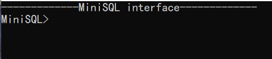
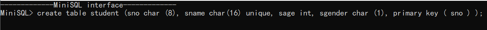
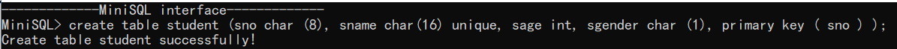
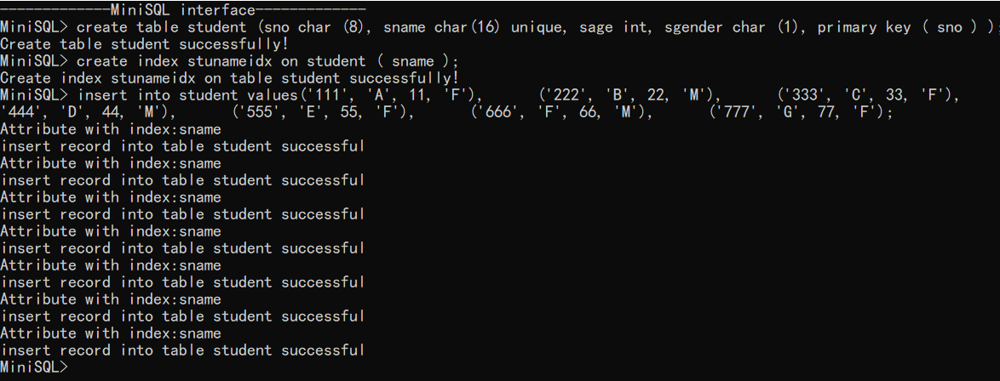
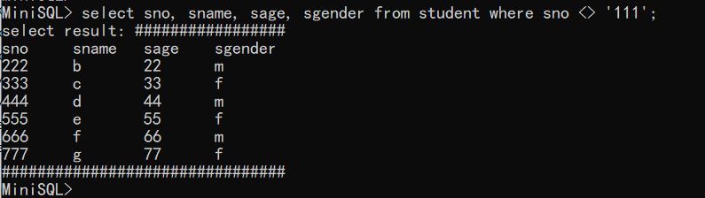
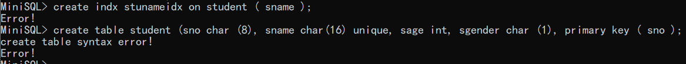
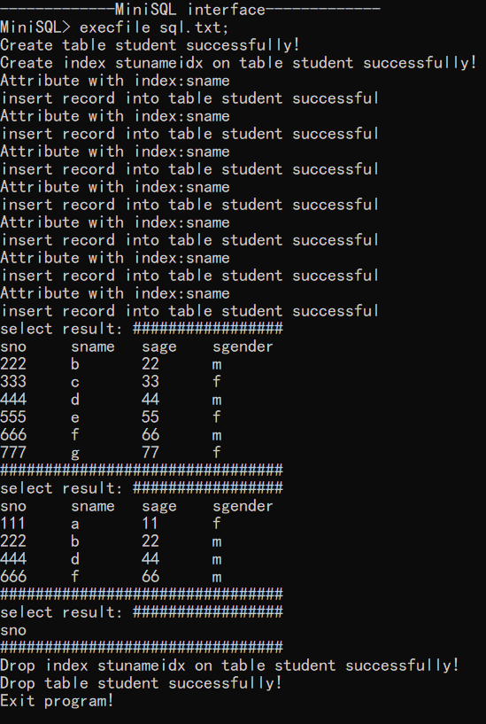

#### 界面说明

---

- `MiniSQL`的登陆界面

- 进入`MiniSQL interface`后，左边出现的`MiniSQL>`提示输入信息

- `MiniSQL`支持语句逐条输入，每条语句以分号结尾

  如创建表格：

  

  回车输入，返回创建结果：

  

  同理创建索引和插入如下：

  

  输入select查询时如下：

  

  当出现语句错误时，`MiniSQL`会报错

  

- `MiniSQL`还支持文件读取输入。

  输入`execfile [文件名]`,即可按顺序执行文件中的语句。

  

- 输入`Exit;`，即可退出`MiniSQL`

  此时程序弹出`Exit program!`,退出程序

  

